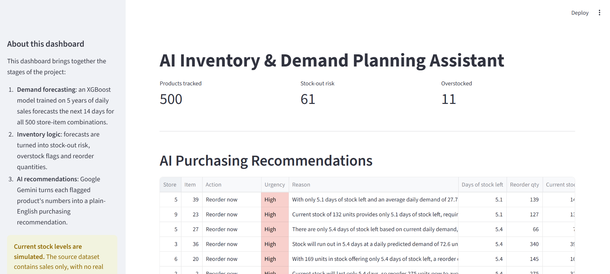

# AI-Powered Demand Forecasting & Inventory Assistant

## 1. Overview

This project focuses on forecasting product-level demand, identifying inventory risk, and generating AI-assisted purchasing recommendations to support smarter stock decisions.

The project follows an end-to-end AI analytics workflow, starting with data loading and Exploratory Data Analysis (EDA) in Python, followed by time-series demand forecasting with XGBoost, business logic to flag stock-out and overstock risk, AI-generated purchasing recommendations using the Google Gemini API, and an interactive dashboard built with Streamlit.

**Project Objectives:**

* Forecast daily product demand across multiple stores and items.
* Identify products at risk of stock-outs or overstocking.
* Translate forecasts and risk flags into actionable reorder recommendations.
* Demonstrate how a traditional ML pipeline can be paired with an LLM layer for business-readable output.

## 2. Dataset

The dataset contains historical daily sales records used to forecast future demand and simulate inventory decisions.

**Key data attributes:**

* Date
* Store ID (10 stores)
* Item ID (50 products)
* Units sold (daily sales)

Source: [Store Item Demand Forecasting Challenge](https://www.kaggle.com/c/demand-forecasting-kernels-only/data) — Kaggle, 5 years of daily sales (913,000 rows), fully clean with no missing values or gaps.

*Note: The dataset contains sales history only. Current inventory stock levels are not available and are simulated for this project — see Section 10 for details.*

## 3. Tools & Technologies

| Tool | Purpose |
| --- | --- |
| Python | Data loading, EDA, and data cleaning |
| Pandas & NumPy | Data manipulation and preprocessing |
| Matplotlib & Plotly | Data visualization |
| Prophet | Baseline time-series forecasting |
| XGBoost | Final demand forecasting model |
| Google Gemini API | AI-generated purchasing recommendations |
| Streamlit | Interactive dashboard development |
| Jupyter Notebook | Python analysis environment |
| Git / GitHub | Version control |

## 4. Project Workflow

### Step 1: Data Loading & Exploratory Data Analysis (EDA)

* Imported the dataset into Python using Pandas.
* Examined dataset structure, dimensions, and data types.
* Checked date range, unique stores/items, and summary statistics.
* Explored weekly, monthly, and day-of-week sales patterns to identify trend and seasonality.

### Step 2: Data Cleaning & Validation

* Checked for missing values, duplicate rows, and duplicate keys.
* Verified data types (date parsed as datetime, sales as numeric).
* Checked for negative or invalid sales values.
* Confirmed the dataset was clean with 0 issues found.

### Step 3: Demand Forecasting

* Built a baseline forecast using Prophet on a single product, tuned with multiplicative seasonality and US holidays.
* Tested XGBoost on the same single product for comparison.
* Built the final model: one XGBoost model trained across all 500 store-item combinations together, using lag features (7/14/365 days), rolling averages, and calendar features.
* Evaluated all models on the same 8-week holdout period using MAPE and RMSE.
* Reviewed feature importance and per-store accuracy to validate the model generalizes well.

### Step 4: Inventory Business Logic

* Simulated current stock levels per product (since the dataset has no real inventory data).
* Defined lead time and safety stock assumptions.
* Calculated days-of-stock-left, stock-out risk, reorder quantity, and overstock flags for all 500 products.
* Validated the logic by manually recalculating results for sample rows.

### Step 5: AI-Generated Recommendations

* Filtered to products flagged as stock-out risk or overstocked.
* Sent batches of flagged products' computed numbers to the Google Gemini API.
* Prompted the model to generate an action, urgency level, and plain-English reason per product, using only the numbers provided.
* Handled API rate limits with retry logic and checkpointing so completed batches are never re-requested.
* Replaced LLM-judged urgency with explicit numeric thresholds for consistency, after spot-checking revealed the model was too conservative.
* Verified recommendations against source data to confirm no hallucinated figures.

### Step 6: Dashboard Development

* Built an interactive Streamlit dashboard.
* Added summary metric cards, an AI recommendations panel, a forecast explorer, and a filterable full inventory table.
* Verified all displayed numbers matched the underlying data files.

## 5. Dashboard

The Streamlit dashboard provides an interactive overview of demand forecasts, inventory risk, and AI-generated purchasing recommendations.

**Key dashboard components:**

* Summary metrics: total products tracked, stock-out risk count, overstock count
* AI Purchasing Recommendations table with urgency, action, and reasoning
* Forecast Explorer: actual vs. 14-day forecasted demand per store/item, with current stock status
* Full Inventory Status table with store and risk-type filters

*Dashboard screenshots can be added here.*



## 6. Results & Business Insights

### Forecasting performance

| Model | Scope | MAPE | RMSE |
| --- | --- | --- | --- |
| Prophet (tuned) | Single product | 23.19% | 4.55 |
| XGBoost | Single product | 25.20% | 4.92 |
| **XGBoost (final)** | **All 500 products, pooled** | **14.73%** | 8.07 |

* The pooled XGBoost model outperformed both single-product models, and generalized consistently across stores (per-store MAPE range: 12.66%–17.97%).
* `rolling_mean_7` and `lag_7` accounted for 82% of the model's predictive power; `store` and `item` contributed ~0%, since product identity was already implicitly captured in each product's own recent sales history.

### Inventory & recommendations

* 61 of 500 products (12.2%) flagged as stock-out risk.
* 11 of 500 products (2.2%) flagged as overstocked.
* 72 of 72 flagged products received an AI-generated recommendation, spot-checked against source data with no hallucinated figures found.

## 7. How to Run

### Prerequisites

Install or set up the following tools:

* Python 3.14.7
* Jupyter Notebook (VS Code recommended)
* A Google Gemini API key (free tier available)

### Setup Instructions

**1. Clone the repository**

```bash
git clone <https://github.com/Sohini-dotcom/AI-demand-forecasting-inventory-assistant>
cd ai-demand-forecasting-inventory-assistant
```

**2. Create a virtual environment and install the required Python libraries**

```bash
python -m venv venv
source venv/bin/activate   # Windows: .\venv\Scripts\Activate.ps1
pip install pandas numpy prophet xgboost streamlit plotly google-generativeai python-dotenv
```

**3. Add your API key**

Create a `.env` file in the project root:

```
GEMINI_API_KEY=your_key_here
```

**4. Run the notebooks in order**

* Open the notebooks in `notebooks/` in VS Code or Jupyter.
* Run `explore.ipynb`, then the forecasting notebooks, then `inventory_logic.ipynb`, then `ai_recommendations.ipynb`.

**5. Launch the dashboard**

```bash
streamlit run src/dashboard.py
```

**6. Review the project deliverables**

* Forecasting notebooks and model comparison
* Inventory logic and simulated stock data
* AI recommendations output
* Streamlit dashboard

## 8. Project Structure

```text
ai-demand-forecasting-inventory-assistant/
│
├── data/
│   ├── train.csv
│   ├── inventory_status.csv
│   └── ai_recommendations.csv
│
├── notebooks/
│   ├── explore.ipynb
│   ├── forecast_single_product.ipynb
│   ├── forecast_xgboost.ipynb
│   ├── forecast_xgboost_all_products.ipynb
│   ├── inventory_logic.ipynb
│   └── ai_recommendations.ipynb
│
├── src/
│   └── dashboard.py
│
├── images/
│   └── dashboard-overview.png
│
└── README.md
```

## 9. Deliverables

* Cleaned and validated sales dataset
* Python notebooks for EDA, forecasting, business logic, and AI recommendations
* Trained demand forecasting model (XGBoost) with documented evaluation
* AI-generated purchasing recommendations for flagged products
* Interactive Streamlit dashboard

## 10. Limitations & Assumptions

* **Inventory levels are simulated.** The source dataset contains sales history only, with no real stock data. Current stock was randomly simulated as 5–20 days' worth of each product's average demand.
* Lead time (7 days) and safety stock (3 days) are fixed assumptions, not learned per product or store.
* The model was evaluated on a single 8-week holdout period, not cross-validated across multiple time windows.
* Google Gemini's free tier has per-minute and per-day rate limits, which affected how recommendations were batched and generated.

## 11. Conclusion

This project demonstrates an end-to-end AI analyst workflow by combining Python-based forecasting, business logic, and an LLM layer to transform raw sales data into actionable inventory recommendations.

It showcases practical skills in time-series forecasting, model comparison and evaluation, prompt engineering with grounded/facts-first prompting, handling real API constraints (rate limits, retries, checkpointing), and building an interactive dashboard — with an emphasis on verifying AI output against real data rather than trusting it blindly.

---

**Author:** Sohini Chandra
**Role:** Data Analyst 
